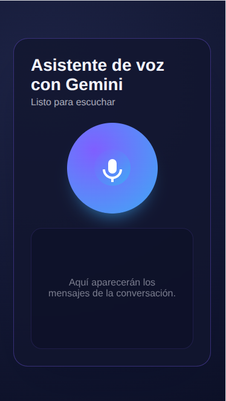

# Live Talking Gemini

Reinventa la atención en tiempo real con un asistente de voz sobre Gemini que responde al instante, escucha a tus usuarios y se auto-silencia en cuanto detecta que alguien vuelve a hablar. El proyecto ofrece una base lista para demos, hackathons o integraciones productivas con latencia ultrabaja.



## Funcionalidades Clave
- **Conversación dúplex** sobre WebSocket con Gemini, streaming de entrada y salida sin interrupciones.
- **Audio impecable** gracias al prebuffer inteligente que mantiene un colchón de ~180 ms y evita microcortes.
- **Detección de voz local** para silenciar al modelo cuando el usuario interviene y reanudar al terminar.
- **Front-end ligero** en HTML/JS puro: sólo abre `index.php` o lanza el servidor embebido de PHP.
- **Despliegue sin fricción**: basta con un API Key de Google AI Studio y ejecutar un único comando.

## Arquitectura en Breve
1. El cliente captura audio en 16 kHz, lo normaliza y lo envía como PCM Base64 a través de la sesión bidi de Gemini.
2. El backend (`api.php`) firma la sesión y entrega el token de acceso temporal.
3. Las respuestas de audio se almacenan en una cola, se preprograman en el `AudioContext` y se reproducen sin saltos.
4. Un detector RMS local desactiva la cola cuando detecta voz humana, logrando interrupciones inmediatas.

## Requisitos
- PHP 8.1+ con servidor embebido (`php -S`).
- Navegador Chromium/Chrome o Edge (Web Audio + WebSocket).
- Node.js opcional si deseas ejecutar herramientas auxiliares.

## Configuración Rápida
1. Crea un API Key en [Google AI Studio](https://aistudio.google.com/).
2. Exporta la clave como variable de entorno antes de iniciar el servidor:
   ```bash
   export GEMINI_API_KEY="tu_clave"
   ```
   También puedes copiar `.env.example` a `.env` y colocar la clave allí.
## Ejecución Local
```bash
php -S 127.0.0.1:8080
```
Visita `http://127.0.0.1:8080` y otorga permiso de micrófono.

## Flujo de Voz
- Haz clic en “Hablar”. El cliente crea un `AudioContext`, solicita `getUserMedia` y abre la sesión Gemini.
- Cada bloque de audio se re-muestrea a 16 kHz y se envía en streaming.
- Las respuestas llegan como texto + audio PCM. El reproductor añade el audio a la cola con start times alineados.
- Cuando comienzas a hablar, el detector RMS corta la cola programada y notifica a Gemini que debe escucharte.

## Personalización
- Ajusta `config.captureRate` (por defecto 16000) si cambias la tasa de captura.
- Modifica `playback.startLeadTime` en `script.js` para aumentar o reducir el buffer inicial.
- Tunea los parámetros `speechThreshold` y `speechHoldMs` para ambientes con más ruido.

## Contribuciones
¡Pull requests bienvenidas! Abre un issue para discutir cambios mayores. Sigue el estilo de código existente y evita incluir secretos en los commits.

## Licencia
Elige la licencia que prefieras (MIT recomendada); añade el archivo `LICENSE` antes de publicar si todavía no lo has hecho.
